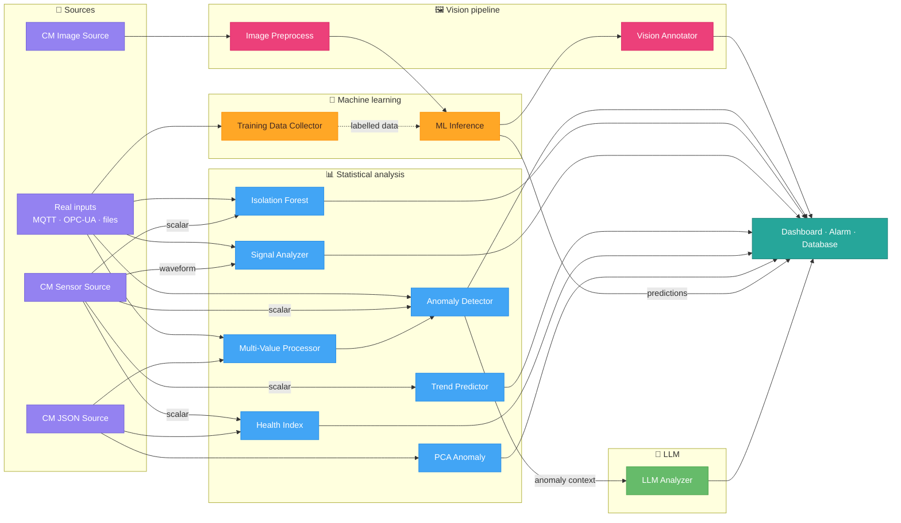
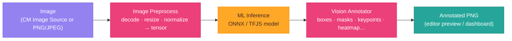
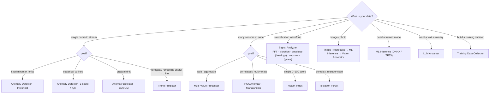

# node-red-contrib-condition-monitoring

A comprehensive Node-RED module for **anomaly detection**, **predictive maintenance**, and **time series analysis**.

[](https://www.npmjs.com/package/node-red-contrib-condition-monitoring)
[](https://www.npmjs.com/package/node-red-contrib-condition-monitoring)
[](https://opensource.org/licenses/MIT)
[](https://nodered.org)
[](https://nodejs.org)
[](CHANGELOG.md)

---

## Table of Contents

- [Project Status: v0.3.1 Beta](#project-status-v031-beta)
- [Important Disclaimer](#important-disclaimer)
- [Features](#features)
- [Installation](#installation)
- [Quick Start](#quick-start)
- [Available Nodes (15 Nodes)](#available-nodes-15-nodes)
- [Pretrained Models (catalog)](#pretrained-models-catalog)
- [Which Node Should I Use?](#which-node-should-i-use)
- [Usage Examples](#usage-examples)
- [Node Configuration Examples](#node-configuration-examples)
- [Dynamic Configuration (msg.config)](#dynamic-configuration-msgconfig)
- [Docker Setup](#docker-setup)
- [Dependencies](#dependencies)
- [Performance Features](#performance-features)
- [Documentation](#documentation)
- [Contributing](#contributing)
- [License](#license)
- [Roadmap](#roadmap)

---

## Project Status: v0.3.1 Beta

**LLM Analyzer, Vision Pipeline & Data-Source Simulators**

- **15 Nodes** - analysis, ML inference, vision pipeline, LLM analysis, and data-source simulators
- **ISO 10816-3 Integration** - Vibration severity assessment with zones A-D
- **Butterworth Filter** - 2nd order IIR filter with zero-phase filtering (filtfilt)
- **Hysteresis (Anti-Flicker)** - Prevents rapid alarm on/off switching
- **Dynamic Sensor Weighting** - Auto-adjusts weights based on sensor reliability
- **Robust RUL Calculation** - Theil-Sen estimator, median filter, moving average smoothing
- **High-Performance FFT** - Radix-4 Cooley-Tukey algorithm via fft.js
- **State Persistence** - Optional context-based state saving across restarts
- **Comprehensive Testing** - 405 unit tests with Jest framework

---

## Important Disclaimer

**This software is provided for condition monitoring and predictive maintenance purposes.**

- **NOT** a replacement for safety-critical systems
- **NOT** suitable as the sole means of safety decision-making
- **Should** be used as an additional monitoring layer
- **Always** validate results with domain experts
- **Follow** proper safety protocols and regulations for your industry

**Use at your own risk. See LICENSE file for full legal terms.**

## Features

- **15 Powerful Nodes** - Complete condition monitoring + vision + LLM toolkit
- **10 Anomaly Detection Methods** - Z-Score, IQR, Moving Average, Threshold, Percentile, EMA, CUSUM, Isolation Forest, PCA, Mahalanobis
- **Signal Analysis** - High-performance FFT (Radix-4), Vibration Features (RMS, Crest Factor, Kurtosis), Peak Detection, Envelope Analysis, Cepstrum, Autocorrelation (ACF), Sample Entropy, Periodicity Detection
- **Correlation Analysis** - Pearson, Spearman, Cross-Correlation with time lag detection
- **Gearbox Diagnostics** - Cepstrum analysis for gear mesh faults
- **Reliability Analysis** - Weibull distribution, B-life, MTTF, RUL
- **Trend Prediction** - Linear Regression, Exponential Smoothing, Rate of Change
- **Multi-Value Processing** - Split, Analyze, Correlate, Aggregate multiple sensors
- **ML Inference** - TensorFlow.js, ONNX, Keras, scikit-learn, TFLite, Google Coral (with persistent Python bridge)
- **State Persistence** - Optional buffer/statistics persistence across restarts

## Installation

**Prerequisites:** Node.js >= 18, Node-RED >= 2.0.0

```bash
npm install node-red-contrib-condition-monitoring
```

Or install directly from Node-RED:
1. Menu → Manage palette
2. Install tab
3. Search for `node-red-contrib-condition-monitoring`
4. Click install

## Quick Start

### With Docker Compose (Recommended)

```bash
# Start Node-RED with the module
docker-compose up -d

# Access at http://localhost:1880
```

### Import Example Flows

1. Open Node-RED: `http://localhost:1880`
2. Menu → Import → Examples
3. Select one of the example flows

## Available Nodes (15 Nodes)

Nodes are grouped in the palette under five **`Condition Monitoring`** categories:
**Condition Monitoring Stats** (analysis), **Condition Monitoring ML**
(ml-inference, training-data-collector), **Condition Monitoring Vision**
(image-preprocess, vision-annotator), **Condition Monitoring LLM** (llm-analyzer)
and **Condition Monitoring Demo** (condition-monitoring-source, image-source, json-source).

**Data sources for testing:** `condition-monitoring-source` simulates realistic
sensor data — trended KPIs (vibration RMS, temperature, current, pressure with
degradation, faults, ISO thresholds, RUL) and, in **waveform mode**, a raw
vibration time-signal so the signal-analyzer (FFT/envelope/kurtosis) can be
driven too. `image-source` is its visual counterpart: it generates synthetic
inspection images with configurable defects (spot/scratch) + a ground-truth
mask to drive the vision pipeline. `json-source` is a generic structured-data
simulator — you define arbitrary fields (mean/noise/trend, optional anomaly
injection) and it emits JSON records to drive the object/record nodes
(multi-value-processor, health-index, pca-anomaly, training-data-collector,
llm-analyzer record mode).

### Architecture at a glance

How the nodes fit together — data sources (or real inputs) feed the processing
nodes, which emit results to dashboards/alarms/storage:



The vision path is its own short pipeline:



### Core Analysis Nodes

### 1. Anomaly Detector

**7 detection methods in one node:**

| Method | Best For |
|--------|----------|
| **Z-Score** | Normal distributions, general purpose |
| **IQR** | Robust to outliers, skewed data |
| **Threshold** | Fixed min/max limits |
| **Percentile** | Dynamic bounds based on data distribution |
| **EMA** | Recent changes, adaptive baseline |
| **CUSUM** | Drift detection, gradual shifts |
| **Moving Average** | Smoothed baseline comparison |

**Hysteresis (Anti-Flicker):**
- Prevents rapid alarm on/off switching near thresholds
- Configurable consecutive samples before triggering
- Deadband percentage for exiting anomaly state

**Multi-Sensor JSON Input:**
- Accepts JSON objects with multiple sensors: `{ "temp": 65.2, "pressure": 4.5 }`
- Maintains separate buffers and hysteresis states per sensor
- Outputs combined result with per-sensor analysis

**Example:**
```
[MQTT Sensor] → [Anomaly Detector (Z-Score)] → [Normal] → [Dashboard]
                                              → [Anomaly] → [Alarm]
```

### 2. Isolation Forest

**ML-based anomaly detection with online learning:**
- Unsupervised learning - no training labels required
- Detects complex, multivariate anomalies
- **3 learning modes:**
  - **Batch** - Retrain when buffer full
  - **Incremental** - Periodic retraining (configurable interval)
  - **Adaptive** - Auto-adjust threshold based on feedback
- Configurable number of trees and samples per tree

### 3. Multi-Value Processor

**4 modes for multi-sensor data:**

| Mode | Function |
|------|----------|
| **Split** | Extract individual values from arrays/objects |
| **Analyze** | Anomaly detection per value (Z-Score, IQR, Threshold, **Mahalanobis**) |
| **Correlate** | Pearson, Spearman, or **Cross-Correlation** between two sensors |
| **Aggregate** | Reduce to single value (Mean, Median, Min, Max, Sum, Range, StdDev) |

**Mahalanobis Distance:** Detects multivariate anomalies considering correlations between sensors.

**Cross-Correlation:** Finds time lag between sensors - detects propagation delays (e.g., temperature wave through pipe).

**Example:**
```
[Sensors] → [Multi-Value (Split)] → [Anomaly Detector] → ...
[Sensors] → [Multi-Value (Aggregate)] → Mean value for dashboard
```

### 4. Signal Analyzer

**5 modes for signal analysis:**

| Mode | Output |
|------|--------|
| **FFT** | Frequency peaks, spectral features |
| **Vibration** | RMS, Crest Factor, Kurtosis, Skewness, Health Score, **ISO 10816-3 assessment** |
| **Peaks** | Local maxima/minima detection |
| **Envelope** | Bearing fault detection (BPFO, BPFI, BSF, FTF) with **Butterworth filter** |
| **Cepstrum** | Gearbox fault detection (GMF, sidebands) |

**ISO 10816-3 Vibration Severity:**
- Machine classes I-IV (small to large machines)
- Zones A-D with severity levels and recommendations
- Automatic alarm/warning thresholds

**Butterworth Filter:**
- 2nd order IIR filter for envelope analysis
- Zero-phase filtering (filtfilt) - no phase distortion
- Automatic fallback for edge cases

**Example:**
```
[Vibration Sensor] → [Signal Analyzer (Vibration)] → RMS, ISO 10816 Zone
                   → [Signal Analyzer (FFT)] → Frequency Peaks
                   → [Signal Analyzer (Envelope)] → Bearing faults
```

### 5. Trend Predictor

**3 modes for trend analysis:**

| Mode | Output |
|------|--------|
| **Prediction** | Future values, trend direction |
| **RUL** | Remaining Useful Life with confidence intervals |
| **Rate of Change** | First/second derivative, acceleration |

**RUL Features:**
- Configurable failure and warning thresholds
- Multiple time units (hours, minutes, days, cycles)
- Confidence intervals for predictions
- Status: healthy/warning/critical/failed
- **Degradation models:** Linear, Exponential, Weibull (reliability-based)
- **Robust calculation:** Theil-Sen estimator, median filter, moving average smoothing

**Multi-Sensor JSON Input:**
- Accepts JSON objects with multiple sensors: `{ "temp": 65.2, "vibration": 2.5 }`
- Calculates trends/RUL for each sensor independently
- Tracks threshold exceedance per sensor

**Weibull Analysis:**
- Automatic Weibull parameter estimation (β, η)
- **B-Life calculation** (B1, B5, B10, B50) - time when X% have failed
- Failure mode classification (infant_mortality, useful_life, wear_out, rapid_wear_out)
- MTTF calculation

**Example:**
```
[Temperature] → [Trend Predictor (RUL)] → "RUL: 48.5h (95% confidence)"
```

### 6. Health Index

**Multi-sensor health aggregation:**
- Weighted combination of sensors
- 0-100% health score
- Configurable aggregation methods (Weighted, **Dynamic**, Minimum, Average, Geometric)
- **Dynamic weighting** - Auto-adjusts weights based on sensor reliability
- **Visual threshold configuration** with slider-based UI
- Configurable status levels (healthy, warning, degraded, critical)
- Automatic worst sensor identification with reliability metrics

### 7. ML Inference

**Machine Learning model inference with multiple runtime options:**

#### JavaScript Runtimes (npm install)
Work immediately after installation - no additional setup:
- **ONNX** (.onnx) - PyTorch, TensorFlow, scikit-learn models
- **TensorFlow.js** (model.json + .bin) - Keras, TensorFlow models

#### Python Runtimes (Docker/Python required)
Require Python environment with ML libraries:
- **TFLite** (.tflite) - Edge/mobile optimized models
- **Keras** (.keras, .h5) - Native Keras models
- **scikit-learn** (.pkl, .joblib) - Classic ML (Random Forest, SVM, etc.)

#### Hardware Accelerated
- **Google Coral / Edge TPU** - 10-100x faster inference

**Tip:** Use ONNX format for best compatibility across frameworks. The node automatically detects available runtimes and shows warnings for Python-dependent formats.

### 8. PCA Anomaly Detection

**Principal Component Analysis for multi-sensor anomaly detection:**
- Reduces high-dimensional data to principal components
- Detects anomalies using Hotelling's T² and SPE statistics
- **Auto-selects components** based on explained variance threshold
- **Contribution analysis** - identifies which sensor caused the anomaly

| Method | Use Case |
|--------|----------|
| **T²** | Variations within normal operating space |
| **SPE** | New patterns not seen during training |
| **Combined** | Both T² and SPE (recommended) |

### 9. Training Data Collector

**Collects sensor data for ML model training:**

| Feature | Description |
|---------|-------------|
| **3 Collection Modes** | Batch, Streaming (JSONL), Time-Series Windows |
| **Multiple Export Formats** | CSV, JSONL, JSON with metadata |
| **Auto-Compression** | .gz compression for large datasets (>10k samples) |
| **Train/Val/Test Split** | Automatic dataset splitting with configurable ratios |
| **Label Modes** | Manual, from message, RUL countdown, unlabeled |
| **S3 Upload** | Direct upload to AWS S3 buckets |
| **Data Validation** | Rejects NaN/Infinity, tracks statistics |

**Use Cases:**
- Collect labeled training data from live sensors
- Create datasets for the training notebooks
- Export time-series windows for LSTM/Transformer training
- Automatic cloud backup to S3

**Control Actions:**
```javascript
msg.action = "export";   // Export current buffer
msg.action = "clear";    // Clear buffer
msg.action = "stats";    // Get collection statistics
msg.action = "pause";    // Pause collection
msg.action = "resume";   // Resume collection
msg.action = "resetRul"; // Reset RUL counter
```

**Example:**
```
[Sensors] → [Multi-Value Processor] → [Training Data Collector] → [S3/File]
                                              ↑
                              [Inject: action="export"]
```

### 10. LLM Analyzer

**Buffers sensor samples and asks an LLM to analyse them in plain language or structured JSON:**

| Feature | Description |
|---------|-------------|
| **5 Providers** | Anthropic (Claude), OpenAI (GPT), Google (Gemini), Ollama (local), OpenAI-compatible (Groq, Together, OpenRouter, DeepSeek, Mistral, vLLM, LMStudio …) |
| **3 Trigger Modes** | Batch (fire when N samples buffered), Manual (`msg.flush=true`), Interval (every X ms) |
| **2 Input Modes** | Scalar (single sensor stream) or Record (multi-sensor objects with auto-detected columns) |
| **2 Output Modes** | Text or structured JSON with example-based schema + optional dot-path field extraction |
| **Cost Tracking** | Per-call `msg.usage` plus lifetime `msg.totalUsage` and live status indicator |
| **Buffer Caps** | Hard ring-buffer size + separate cap on samples sent to the prompt |
| **Persistence** | Optional buffer + counters survive Node-RED redeploys |
| **Concurrency-safe** | Triggers during in-flight calls are queued, never silently dropped |

**Use Cases:**
- Operator-readable batch summaries ("the last 50 readings look unusual because ...")
- Structured anomaly scoring (LLM returns `{severity, score, summary}` → switch-node routes alarms)
- Cross-sensor correlation in record mode ("temp spiked AND pressure dropped — typical leak pattern")
- Edge-deployable with Ollama for air-gapped sites

**Configuration:**
```javascript
// Inputs
msg.payload    // number / number[] (scalar) or object / object[] (record)
msg.flush      // true → fire now (manual mode)
msg.prompt     // per-message override of user prompt template
msg.systemPrompt, msg.model, msg.apiUrl  // per-message overrides

// Outputs
msg.payload    // text response, parsed JSON object, or extracted field
msg.usage      // { inputTokens, outputTokens } from this call
msg.totalUsage // lifetime running totals + callCount
msg.samples    // exact batch sent — useful for archiving / replay
msg.json       // (JSON mode) full parsed object
msg.rawResponse // (JSON mode) raw LLM text
```

**Example:**
```
[Sensor] → [Anomaly Detector] → [LLM Analyzer (json)] → [Switch on score≥0.7] → [Alert]
```

---

### 11. Condition Monitoring Data Source

**Synthetic sensor stream of a degrading machine — for demos, testing and predictive-maintenance prototyping** (palette label **CM Sensor Source**):

| Feature | Description |
|---------|-------------|
| **Asset types** | Pump, motor, fan, gearbox (with configurable RPM → shaft frequency) |
| **Output modes** | `object` (full JSON), `value` (vibration RMS), or `waveform` (raw vibration time-signal array + `msg.samplingRate`, for the Signal Analyzer) |
| **Degradation model** | Health (0–100%) decays by `degRate × loadFactor × (1 + Σ fault severity)` |
| **Derived sensors** | Vibration RMS (mm/s), temperature (°C), current (A), pressure (bar) |
| **Fault injection** | Imbalance (1×), misalignment (2×), bearing (~3.5×), looseness (0.5×) with characteristic frequencies |
| **Thresholds + RUL** | ISO 10816-style warn/alarm levels and an estimated remaining useful life |
| **Streaming control** | Auto-start on deploy, interval timer, or manual inject; `start`/`stop`/`reset` commands |
| **Runtime overrides** | `msg.config` adjusts load, faults, noise, thresholds and interval live |
| **Reproducible** | Optional integer `seed` for deterministic streams |

**Configuration:**
```javascript
// Control inputs
msg.payload = "start" | "stop" | "reset";   // or msg.start / msg.stop / msg.reset = true
msg.config  = {                              // live reconfiguration
  load: 90, degRate: 0.2, noise: 0.1,
  faults: { bearing: 0.85, imbalance: 0.2 },
  warnThreshold: 4.5, alarmThreshold: 7.1, intervalMs: 500
};
msg.emit = true;   // with msg.config: also emit a sample immediately

// Output (object mode)
msg.payload = { asset, health, status, rul, sensors:{...}, faults:[...], thresholds:{...} };
msg.status  // "normal" | "warning" | "alarm"
msg.health  // 0–100
msg.alarm   // boolean
```

**Example:**
```
[Inject "start"] → [CM Data Source] → [Health Index / Signal Analyzer / Anomaly Detector]
```

---

### Vision Nodes (for image models)

### 12. Image Preprocess

**Turns a real image (PNG/JPEG Buffer) into a normalized tensor for `ml-inference`** — pure-JS (`pngjs` + `jpeg-js`, no native deps).

| Feature | Description |
|---------|-------------|
| **Decode** | PNG and JPEG buffers |
| **Resize** | bilinear / nearest to a target W×H |
| **Normalize** | `0-1`, `0-255`, `-1..1`, `imagenet` (mean/std), or `custom` mean/std |
| **Layout** | `NCHW` (ONNX) or `NHWC` (TFJS); channel order RGB/BGR; optional grayscale |
| **Keeps the image** | sets `msg.image` (resized PNG) so `vision-annotator` can draw on the real photo |

Output: `msg.payload` = flat tensor, `msg.tensorShape` = e.g. `[1,3,224,224]`, `msg.preprocess` = metadata. Set the `ml-inference` **Input shape** to match.

### 13. Vision Annotator

**Renders an image-model's output as an annotated image** (PNG `Buffer` on `msg.payload`) plus structured `msg.annotations`. 9 modes:

| Mode | Annotation |
|------|------------|
| `boxes` | bounding boxes (xyxy or yolo + NMS) |
| `obb` | oriented / rotated boxes |
| `segmentation` | semantic class-mask overlay (+ area fractions) |
| `instances` | per-object masks + bbox + area |
| `polygons` | contour outlines (+ area & perimeter) |
| `keypoints` | keypoints + skeleton (pose) |
| `heatmap` | scalar field → jet/gray colormap (depth / CAM / density) |
| `anomaly` | anomaly score field → heatmap + thresholded regions + metrics |
| `classification` | label banner + status dot (softmax confidence) |

With **Editor preview** on (default), the annotated image is drawn live as a thumbnail **under the node on the canvas** — double-click it to enlarge. Display it elsewhere with a dashboard `ui_image`, or via `msg.payload`.

A ready-to-run, self-validating example flow that exercises every node and every
annotation mode (with both synthetic and **real pretrained models** — SqueezeNet,
YOLOv10, YOLOv8-pose, Depth-Anything) lives in `examples/test-suite.json`. Fetch
the models first with `bash tools/fetch-models.sh`, then `GET /test` runs all
checks and `GET /gallery` shows every annotated image.

### Data Source Nodes (Demo)

Simulate input so any node can be tested without real hardware. (The **CM Sensor
Source**, node #11 above, is the third one — it also has a **waveform** output
mode that emits a raw vibration time-signal for the Signal Analyzer.)

### 14. CM Image Source

**Synthetic inspection-image generator** (`image-source`) — the visual counterpart.
Produces a textured surface with configurable defects (spot / scratch / multiple),
severity, noise and optional *degrade over time*, plus a **ground-truth mask**
(`msg.mask`) and defect list. Drives the whole vision pipeline.

### 15. CM JSON Source

**Generic structured-data simulator** (`json-source`). Define arbitrary fields
(`{ "temperature": { "mean": 60, "noise": 2, "trend": 0.05 }, "asset": "pump-01" }`);
each numeric field is `mean + trend·count + gaussian(noise)`, constants pass through.
Optional anomaly injection. Drives the object/record nodes (multi-value-processor,
health-index, pca-anomaly, training-data-collector, llm-analyzer record mode).

---

## Pretrained Models (catalog)

A curated catalog of pretrained models for **common use cases** ships with the
package (`nodes/model-catalog.json`). In the **ML Inference** node, pick one from
the **Pretrained** dropdown — it auto-fills the source, URL, SHA-256, type and
input shape, and shows the matching preprocessing + annotation. The **Insert full
pipeline** button drops a ready-wired `image-preprocess → ml-inference →
vision-annotator` chain.

| Use case | Model | Source | License |
|----------|-------|--------|---------|
| Image classification (ImageNet) | SqueezeNet 1.1 | ONNX Model Zoo | BSD-3-Clause |
| Object detection (COCO) | YOLOv10n (NMS-free) | onnx-community | AGPL-3.0 |
| Human pose / keypoints | YOLOv8n-pose | Xenova | AGPL-3.0 |
| Monocular depth | Depth-Anything-v2-small | onnx-community | Apache-2.0 |
| Surface defect segmentation | bundled (trained in-repo) | this package | MIT |
| Vibration fault classification | bundled (trained in-repo) | this package | MIT |

- **Fetched on demand**, not redistributed: `url` models download on deploy into
  `ml-models/cache` and are verified against the catalog's SHA-256. Mind each
  model's **license** (YOLO is AGPL-3.0). Only the small in-repo models are bundled.
- Pre-download everything for offline use with `bash tools/fetch-models.sh`.

---

## Which Node Should I Use?

### Quick Decision Tree

Start from your data and goal, follow to the node:



> Tip: the **Demo** sources (`CM Sensor Source`, `CM Image Source`, `CM JSON Source`) let you drive any of these without real hardware.

---

## Usage Examples

### Simple Temperature Monitoring

```
[MQTT] → [Anomaly Detector] → [Normal] → [Dashboard]
                             → [Anomaly] → [Email Alert]
```

### Motor Predictive Maintenance

```
[Sensors] → [Multi-Value (Split)] → [Anomaly Detector]
                                  → [Trend Predictor] → RUL Display
                                  → [Signal Analyzer (FFT)] → Frequency Chart
          → [Health Index] → Dashboard
```

### Bearing Vibration Analysis

```
[Vibration] → [Signal Analyzer (Vibration)] → Features
            → [Signal Analyzer (FFT)] → Frequencies
            → [Signal Analyzer (Envelope)] → Bearing Faults
            → [Anomaly Detector (IQR)] → Outliers
```

### ML Anomaly Detection

```
[Features] → [ML Inference (Autoencoder)] → Reconstruction Error → [Anomaly Detector (Threshold)]
```

---

## Node Configuration Examples

### Anomaly Detector (Z-Score)

```javascript
// Input
msg.payload = 42.5;

// Output
{
  "payload": 42.5,
  "isAnomaly": true,
  "severity": "critical",
  "method": "zscore",
  "zScore": 3.2,
  "mean": 35.0,
  "stdDev": 2.3,
  "threshold": 3.0,
  "warningThreshold": 2.0,
  "bufferSize": 100,
  "windowSize": 100
}
```

### Signal Analyzer (FFT)

```javascript
// Input (continuous stream)
msg.payload = 0.45;

// Output
{
  "payload": 0.45,
  "peaks": [
    { "frequency": 30, "magnitude": 0.5 },
    { "frequency": 157, "magnitude": 0.3 }
  ],
  "dominantFrequency": 30,
  "features": {
    "spectralCentroid": 85.2,
    "crestFactor": 3.5,
    "rms": 0.42
  }
}
```

### Trend Predictor (RUL Mode)

```javascript
// Input
msg.payload = 75.2;
msg.timestamp = Date.now();

// Output (RUL Mode)
{
  "payload": 75.2,
  "rul": {
    "value": 48.5,
    "unit": "hours",
    "lower": 42.1,          // Lower confidence bound
    "upper": 55.2,          // Upper confidence bound
    "confidence": 0.87,     // R-squared
    "status": "warning"     // healthy/warning/critical/failed
  },
  "degradation": {
    "percent": 75.2,        // % toward failure threshold
    "rate": 0.5,            // Degradation rate per sample
    "trend": "increasing"
  },
  "thresholds": {
    "failure": 100,
    "warning": 80
  }
}
```

---

## Dynamic Configuration (msg.config)

All major nodes support dynamic runtime configuration via `msg.config`. This allows you to override node settings on a per-message basis without redeploying the flow.

### Supported Nodes and Parameters

#### Anomaly Detector

```javascript
msg.config = {
  method: "zscore",           // Override detection method
  zscoreThreshold: 2.5,       // Override Z-score threshold
  zscoreWarning: 1.8,         // Override warning threshold
  iqrMultiplier: 1.5,         // Override IQR multiplier
  minThreshold: 10,           // Override min threshold
  maxThreshold: 100,          // Override max threshold
  hysteresisEnabled: false,   // Enable/disable hysteresis
  consecutiveCount: 5         // Override consecutive count
};
msg.payload = 42.5;
```

#### Trend Predictor

```javascript
msg.config = {
  mode: "rate-of-change",     // Override mode (prediction/rate-of-change/rul)
  threshold: 80,              // Override prediction threshold
  rocThreshold: 5,            // Override rate of change threshold
  failureThreshold: 100,      // Override RUL failure threshold
  warningThreshold: 80,       // Override RUL warning threshold
  predictionSteps: 10         // Override prediction horizon
};
msg.payload = 75.2;
```

#### Signal Analyzer

```javascript
msg.config = {
  mode: "vibration",          // Override mode (fft/vibration/peaks/envelope/cepstrum)
  vibrationThreshold: 5,      // Override vibration threshold
  peakThreshold: 0.3          // Override peak detection threshold
};
msg.payload = [0.5, 0.7, 0.3, ...];
```

#### Health Index

```javascript
msg.config = {
  healthyThreshold: 90,       // Override healthy threshold
  warningThreshold: 70,       // Override warning threshold
  degradedThreshold: 50,      // Override degraded threshold
  criticalThreshold: 25,      // Override critical threshold
  aggregationMethod: "minimum", // Override aggregation (weighted/dynamic/minimum/average/geometric)
  sensorWeights: {            // Override sensor weights
    "temp": 2.0,
    "vibration": 1.5
  }
};
msg.payload = { temp: 45, vibration: 2.3 };
```

### Use Cases

1. **Adaptive Thresholds**: Adjust thresholds based on time of day, operating mode, or external conditions
2. **A/B Testing**: Compare different detection parameters on the same data stream
3. **Contextual Sensitivity**: Use tighter thresholds during critical operations
4. **Batch Processing**: Process historical data with different configurations

---

## Docker Setup

### For ML Inference Node

**The ML Inference node requires a Debian-based container with native dependencies.**

```bash
# Use the provided docker-compose.dev.yml
docker-compose -f docker-compose.dev.yml up

# This builds a custom image with:
# - Python 3 + build tools
# - TensorFlow.js Node bindings
# - ONNX Runtime Node bindings
```

### Standard Setup

```bash
# Production mode
docker-compose up

# Development mode (hot-reload)
docker-compose -f docker-compose.dev.yml up
```

### GPU Acceleration (NVIDIA, optional)

Both inference paths — the direct TensorFlow.js path in the Node-RED container **and** the MAX Engine bridge path (MAX Engine + ONNX Runtime) — can optionally run on an NVIDIA GPU. The CPU path stays the default; GPU is opt-in.

**Host prerequisites:**
- NVIDIA driver (compatible with CUDA 12.x)
- [NVIDIA Container Toolkit](https://docs.nvidia.com/datacenter/cloud-native/container-toolkit/install-guide.html)
- Docker with Compose v2

**Enable via Compose override:**

```bash
docker compose -f docker-compose.dev.yml -f docker-compose.gpu.yml up --build
```

The override file swaps the Dockerfiles for their GPU variants (`Dockerfile.gpu`, `Dockerfile.max.gpu`) at build time and reserves the GPU(s) via `deploy.resources`. What this does:

| Container        | GPU image base                               | Enabled backends |
|------------------|----------------------------------------------|---------------------|
| `node-red`       | `nvidia/cuda:12.4.1-cudnn-runtime-ubuntu22.04` | `@tensorflow/tfjs-node-gpu`, `tensorflow[and-cuda]` |
| `max-engine`     | `nvidia/cuda:12.4.1-cudnn-runtime-ubuntu22.04` | MAX Engine (GPU) + `onnxruntime-gpu` (`CUDAExecutionProvider`) |

The bridge code (`nodes/python/max_bridge.py`) automatically selects the best available backend in this order: **MAX Engine GPU → ONNX Runtime CUDA → ONNX Runtime CPU**.

**Verification:**

```bash
# ONNX Runtime should list CUDAExecutionProvider
docker compose -f docker-compose.dev.yml -f docker-compose.gpu.yml \
  exec max-engine python3 -c "import onnxruntime as ort; print(ort.get_available_providers())"

# Bridge status (shows backend & loaded models)
curl http://localhost:8765/status

# Inside the Node-RED container: tfjs-node-gpu should find CUDA
docker compose -f docker-compose.dev.yml -f docker-compose.gpu.yml \
  exec node-red node -e "require('@tensorflow/tfjs-node-gpu'); console.log('OK')"
```

**Notes:**
- The GPU images are significantly larger (several GB), so the first build takes correspondingly longer.
- If a single GPU path is enough, you can trim the override file and keep only the `max-engine` or only the `node-red` service block.
- For MAX-Engine-only acceleration, the official `modular/max-nvidia-full` images are an alternative — usable as a drop-in for `Dockerfile.max.gpu` (base image swap).

---

## Dependencies

### Required
- Node-RED >= 2.0.0
- Node.js >= 18.0.0 (the LLM Analyzer node uses the built-in `fetch`)

### Core Dependencies
- `fft.js` - High-performance FFT (Radix-4 Cooley-Tukey algorithm)
- `ml-isolation-forest` - For Isolation Forest node
- `simple-statistics` - For statistical functions

### Optional - JavaScript ML Runtimes
- `@tensorflow/tfjs-node` - TensorFlow.js support
- `onnxruntime-node` - ONNX Runtime support

### Optional - Python ML Runtimes (Docker or manual)
For TFLite, Keras, and scikit-learn models:
```bash
pip install numpy tensorflow scikit-learn joblib tflite-runtime
# Use numpy<2 for tflite-runtime compatibility
pip install "numpy<2"
```

---

## Performance Features

### High-Performance FFT

The Signal Analyzer uses `fft.js` with the Radix-4 Cooley-Tukey algorithm:
- **O(n log n)** complexity vs O(n²) for naive DFT
- **10-100x faster** for large signal buffers (2048+ samples)
- Automatic power-of-2 sizing and windowing (Hann, Hamming, Blackman)

### Persistent Python Bridge

For Python-based ML models (Keras, scikit-learn, TFLite), a persistent subprocess is maintained:
- **Single Python process** shared across all ML Inference nodes
- **Model caching** - models stay loaded in memory between inferences
- **10-100x faster** compared to spawning a new process per inference
- **Automatic restart** if the bridge crashes

Check bridge status via API: `GET /ml-inference/python-bridge`

### State Persistence

Enable **Persist State** in node configuration to save:
- Data buffers and training history
- Calculated statistics (mean, std, thresholds)
- Trained model states (PCA, Isolation Forest)

States survive Node-RED restarts when using file-based context storage:
```javascript
// settings.js
contextStorage: {
    default: { module: "localfilesystem" }
}
```
Or use the provided Docker image which includes all dependencies.

---

## Documentation

- **[training/models/README.md](training/models/README.md)** - ML models guide and training instructions
- **[CHANGELOG.md](CHANGELOG.md)** - Version history and changes

---

## Contributing

Contributions are welcome! Please:
1. Fork the repository
2. Create a feature branch
3. Add tests if applicable
4. Submit a pull request

## License

MIT License - see [LICENSE](LICENSE) file for details.

## Author

**blanpa**

---

## Roadmap

- [x] Consolidate nodes into unified components
- [x] ML Inference with Model Registry
- [x] Google Coral / Edge TPU support
- [x] PCA Anomaly Detection
- [x] Bearing fault detection via Signal Analyzer (Envelope Mode)
- [x] Weibull reliability analysis
- [x] Cepstrum analysis for gearbox diagnostics
- [x] Mahalanobis distance for multivariate anomalies
- [x] ISO 10816-3 vibration severity assessment
- [x] Hysteresis (anti-flicker) for anomaly detection
- [x] Pre-trained models for common use cases (model catalog + ML Inference picker)

---

**Made with ❤️ for the Node-RED community**
